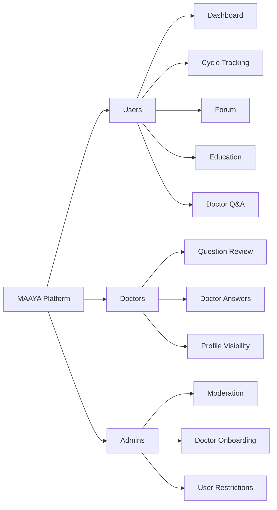

# MAAYA


**MAAYA** is a smart women's and reproductive health platform built to make trusted health information, personal tracking, community support, and doctor guidance easier to access in one safe space.

It is designed around a simple idea: people should be able to learn, track their wellbeing, ask sensitive questions, and join supportive conversations without stigma or fear.

---

## Table of Contents

- [Why MAAYA](#why-maaya)
- [Story](#story)
- [Features](#features)
- [Product Areas](#product-areas)
- [Tech Stack](#tech-stack)
- [Getting Started](#getting-started)
- [Environment Variables](#environment-variables)
- [Available Scripts](#available-scripts)
- [Project Structure](#project-structure)

---

## Why MAAYA

Reproductive health is often surrounded by misinformation, discomfort, and limited access to reliable care. MAAYA brings together education, health tools, community discussion, and verified medical insight so users can make more informed decisions about their wellbeing.

The platform focuses on:

- **Privacy-first participation** for sensitive health discussions.
- **Accessible education** through articles, STI awareness content, and quizzes.
- **Personal tracking** for cycles, symptoms, mood, and health patterns.
- **Doctor support** through verified doctor profiles and question workflows.
- **Community safety** with reporting, moderation, and account restrictions.

---

## Story

MAAYA started from a problem many people quietly face: important reproductive health questions often stay unasked. Someone may notice a symptom, feel unsure about their cycle, worry about an STI, or need guidance from a doctor, but still hesitate because the topic feels too private, too confusing, or too uncomfortable to discuss openly.

The project imagines a calmer path. A user can begin by learning from simple educational content, then track what is happening in their own body, ask a question anonymously when they need help, and hear from verified doctors or a supportive community. Instead of scattering these needs across search results, social media, and disconnected apps, MAAYA brings them into one focused experience.

The platform is also built with responsibility in mind. Sensitive conversations need privacy, but they also need safety. That is why MAAYA includes anonymous-friendly community features, doctor workflows, notifications, reporting, moderation tools, and account restrictions. The goal is not only to provide features, but to create a trustworthy space where users feel respected while making health decisions.

At its heart, MAAYA is about giving people confidence: confidence to learn, confidence to track changes, confidence to ask for help, and confidence to take reproductive health seriously without shame.

---

## Features

| Area | What MAAYA Supports |
| --- | --- |
| **Authentication** | Credential login, registration, user sessions, and role-aware access with NextAuth. |
| **Health Dashboard** | Personalized overview for cycle status, recent mood, questions, alerts, and activity. |
| **Cycle Tracking** | Period logging, onboarding data, symptoms, mood check-ins, analytics, and health insights. |
| **Education Hub** | Reproductive health articles, STI awareness pages, quizzes, and learning feeds. |
| **Community Forum** | Anonymous-friendly posts, comments, voting, tags, media support, and reporting. |
| **Doctor Q&A** | Users can ask questions, select doctors, receive answers, close questions, and rate doctors. |
| **Verified Doctors** | Public doctor directory with profile pages and doctor ranking support. |
| **Notifications** | Alerts for replies, doctor responses, moderation updates, system messages, and unread counts. |
| **Admin Tools** | Doctor onboarding, user management, moderation queue, content status controls, and restrictions. |

---

## Product Areas



---

## Tech Stack

**Frontend**

- Next.js App Router
- React
- TypeScript
- Tailwind CSS
- shadcn/ui and Radix UI primitives
- Lucide icons
- Sonner toasts

**Backend**

- Next.js Route Handlers
- NextAuth credential authentication
- Drizzle ORM
- Neon serverless PostgreSQL

---

## Getting Started

### 1. Clone the repository

```bash
git clone <repository-url>
cd Maaya
```

### 2. Install dependencies

```bash
npm install
```

### 3. Create the environment file

Create a `.env` file in the project root and add the required values listed in [Environment Variables](#environment-variables).

### 4. Push the database schema

```bash
npm run db:push
```

### 5. Start the development server

```bash
npm run dev
```

Open [http://localhost:3000](http://localhost:3000) in your browser.

---

## Environment Variables

The app reads environment values from `.env`.

```env
DATABASE_URL=
NEXTAUTH_URL=http://localhost:3000
NEXTAUTH_SECRET=
NEWS_API_KEY=
GNEWS_API_KEY=
DOCTOR_REGISTRATION_CODES=
```

| Variable | Purpose |
| --- | --- |
| `DATABASE_URL` | Neon/PostgreSQL connection string used by Drizzle and app queries. |
| `NEXTAUTH_URL` | Base URL for NextAuth callbacks and app routing. |
| `NEXTAUTH_SECRET` | Secret used to sign and secure NextAuth sessions. |
| `NEWS_API_KEY` | Optional key for external news/content integrations. |
| `GNEWS_API_KEY` | Optional key for external news/content integrations. |
| `DOCTOR_REGISTRATION_CODES` | Codes used to control doctor registration access. |

---

## Available Scripts

| Command | Description |
| --- | --- |
| `npm run dev` | Start the local Next.js development server with Turbopack. |
| `npm run build` | Build the production application. |
| `npm run start` | Start the production server after a build. |
| `npm run lint` | Run ESLint. |
| `npm run typecheck` | Run TypeScript without emitting files. |
| `npm run format` | Format TypeScript and TSX files with Prettier. |
| `npm run db:generate` | Generate Drizzle migration files. |
| `npm run db:push` | Push the current schema to the database. |
| `npm run db:seed-admin` | Seed an admin account. |
| `npm run db:apply-restriction-column` | Apply the account restriction timestamp helper migration. |
| `npm run forum:apply-anonymous-privacy` | Apply anonymous forum privacy updates. |
| `npm run forum:backfill-anonymous` | Backfill anonymous forum post data. |

---

## Project Structure

```text
Maaya/
|-- app/                    # Next.js App Router pages, layouts, and API routes
|   |-- (app)/              # Authenticated application routes
|   |-- api/                # Route handlers for auth, forum, doctors, tracking, admin, and more
|   |-- login/              # Login page
|   |-- register/           # User and doctor registration pages
|   `-- verified-doctors/   # Public verified doctor directory
|-- components/             # Reusable UI and feature components
|   `-- ui/                 # shadcn/ui components
|-- lib/                    # Server helpers, auth, content, notifications, moderation, and utilities
|-- src/
|   |-- db.ts               # Drizzle database client
|   `-- schema/             # PostgreSQL schema definitions
|-- scripts/                # Database, admin, privacy, and maintenance scripts
|-- migrations/             # Drizzle migration output
`-- public/                 # Static assets
```

---

## Project Document

**SRS:** [Software Requirements Specification](https://docs.google.com/document/d/1nK6V33R4gKhP-OBHIWly9k2qFYXSdm7zOr07OiGIqX8/edit?usp=sharing)

---

<p align="center">
  <strong>Learn safely. Share privately. Track confidently.</strong>
</p>
